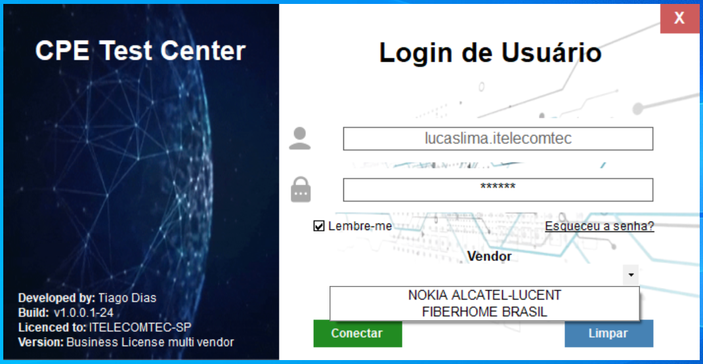
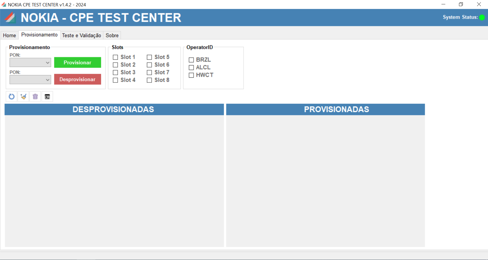
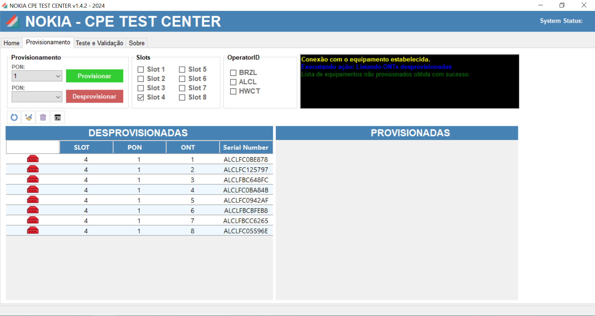
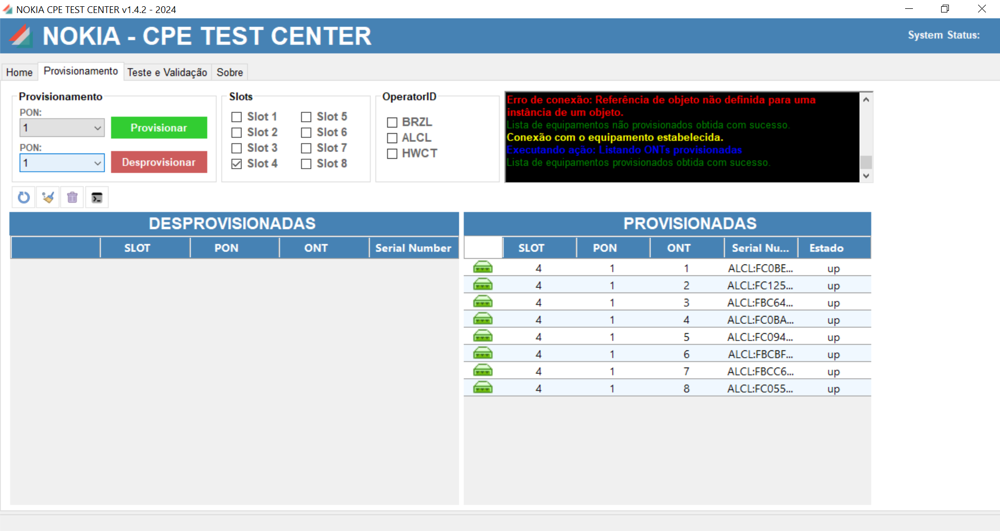
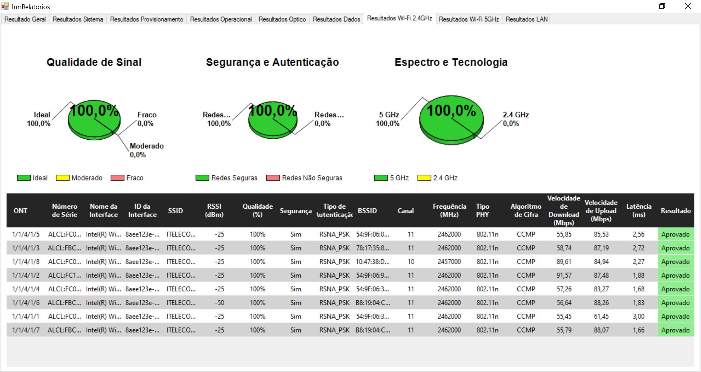
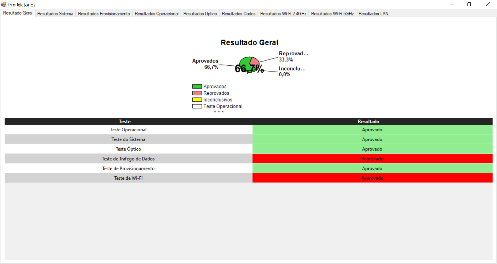
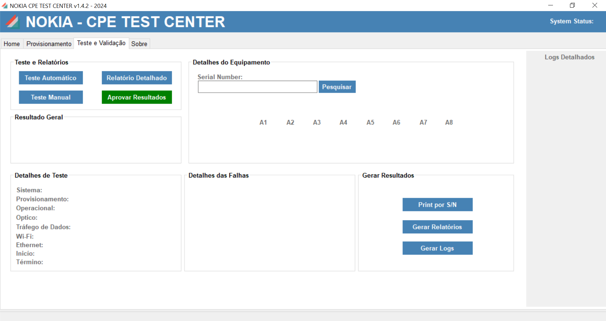
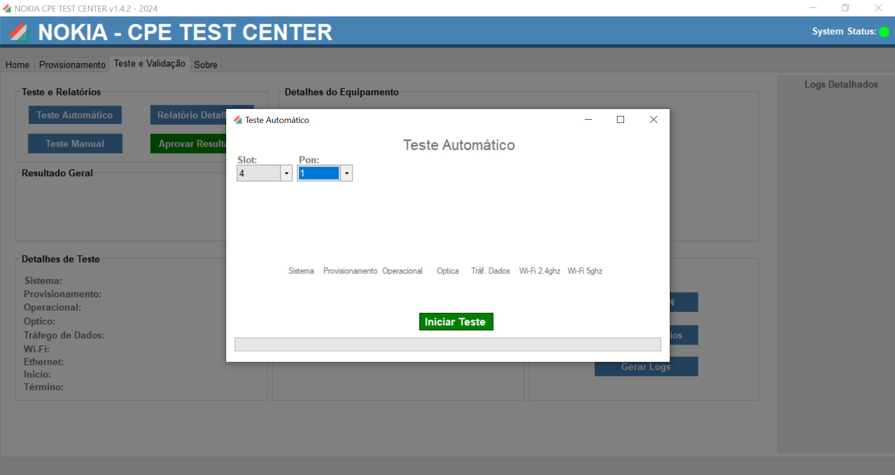
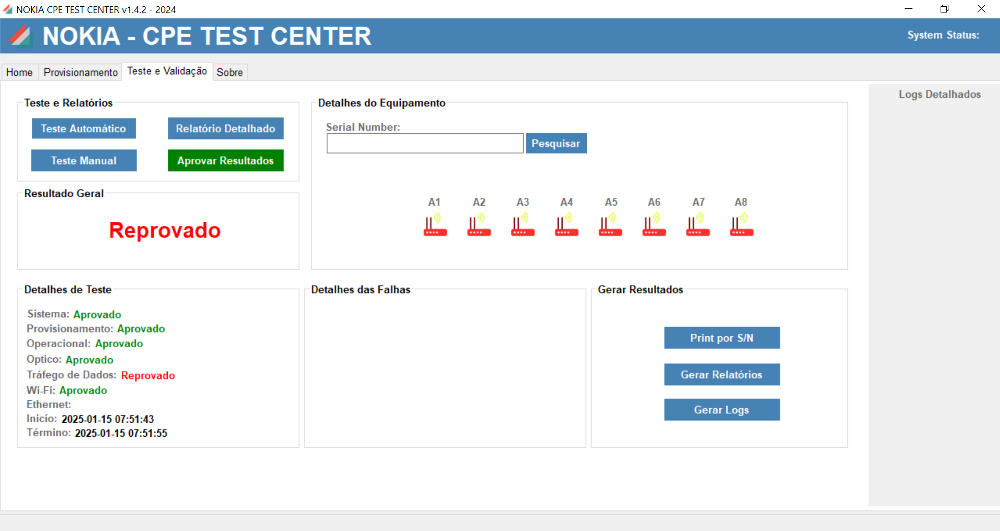

# CPETESTCENTER

## Visão Geral
O **CPETestCenter** é um sistema completo de provisionamento e controle de ONTs (*Optical Network Terminal*). Desenvolvido com foco em eficiência e produtividade, ele permite testar, validar e gerenciar grandes volumes de equipamentos de forma automatizada.

## Funcionalidades Principais
- **Provisionamento e Desprovisionamento** de ONTs.
- **Execução de testes automatizados** para garantir a qualidade e o funcionamento das ONTs.
- **Extração de informações ópticas e operacionais**.
- **Teste de tráfego de dados** e Wi-Fi.
- **Monitoramento e relatórios detalhados** sobre os resultados dos testes.
- **Gerenciamento eficiente** para execução de comandos em massa.
- **Interface gráfica intuitiva** para operação e acompanhamento dos testes.
- **Geração de logs e exportação de dados** para análise.
- **Controle de PON específica** para execução de testes segmentados.

## Estrutura do Projeto
O sistema é organizado da seguinte maneira:
- **`Listar Onus`**: Obtém a lista de ONTs conectadas.
- **`Nokia Testes`**: Classe principal de execução dos testes.
- **`Resultados Testes`**: Armazena os resultados dos testes.
- **`Home`**: Interface principal do sistema.
- **`Relatórios`**: Exibição dos relatórios e histórico de testes.
- **`Testes`**: Seleciona o slot e a PON de teste.
- **`chartProdTotal` e `chartGeral`**: Gráficos para visualização dos resultados.

## Capturas de Tela

### Tela de Login
Interface de login do sistema.

### Provisionamento de ONTs
Interface para provisionamento de ONTs.

### Comando de Provisionamento
Execução do comando de provisionamento.

### Provisionamento Concluído
Confirmação do provisionamento correto da ONT.

### Resultados de Teste Wi-Fi
Exibição dos dados obtidos no teste de Wi-Fi.

### Resultados Gerais
Visão geral dos testes realizados.

### Tela de Teste
Interface para execução dos testes.

### Teste em Execução
Fase de execução dos testes.

### Teste Finalizado
Resultado final do teste realizado.

## Modos de Operação
O CPETestCenter permite operação manual e automatizada:
- **Modo Manual:** O usuário pode iniciar testes individuais ou provisionar ONTs de forma personalizada.
- **Modo Automático:** A ferramenta executa uma bateria completa de testes em todas as ONTs conectadas.

## Testes Realizados
- **Teste de Sistema**: Verifica os parâmetros gerais da ONT.
- **Teste de Provisionamento**: Confirma se a ONT está corretamente provisionada.
- **Teste Operacional**: Analisa o funcionamento geral da ONT.
- **Teste Óptico**: Mede os níveis de potência de recepção e transmissão.
- **Teste de Tráfego de Dados**: Valida a conectividade e desempenho da ONT na rede.
- **Teste de Wi-Fi**: Verifica a força do sinal e qualidade da conexão.
- **Teste de Portas LAN**: Certifica o funcionamento das portas LAN da ONT.
- **Validação de Carcaça**: Inspeção física da ONT.
- **Resultado Final**: Consolida os dados de todos os testes.

## Requisitos de Sistema
- **Sistema Operacional:** Windows 10 ou superior (ou Ubuntu com Mono)
- **Processador:** Intel Core i5 ou equivalente
- **Memória RAM:** 8GB ou superior
- **Armazenamento:** 500MB livres
- **Conectividade:** Acesso remoto às ONTs

## Instalação
1. **Baixar o executável** do CPETestCenter.
2. **Executar o instalador**.
3. **Configurar as credenciais** de acesso.
4. **Iniciar os testes e monitoramento.**

## Atualização
Para atualizar o sistema, basta substituir os arquivos do programa na pasta de instalação. Recomenda-se realizar backup dos dados antes da atualização.

## Contribuição
O projeto é mantido por Tiago Dias e pode receber melhorias e colaborações. Sugestões são bem-vindas!

## Contato
Para suporte ou mais informações:
- **E-mail:** tigdscode@gmail.com
- **LinkedIn:** [linkedin.com/in/tiagodias]
- **GitHub:** [github.com/tiagodias]

---

O CPETestCenter é uma solução poderosa e automatizada para operações em massa de ONTs, garantindo maior controle e eficiência na gestão de redes.
